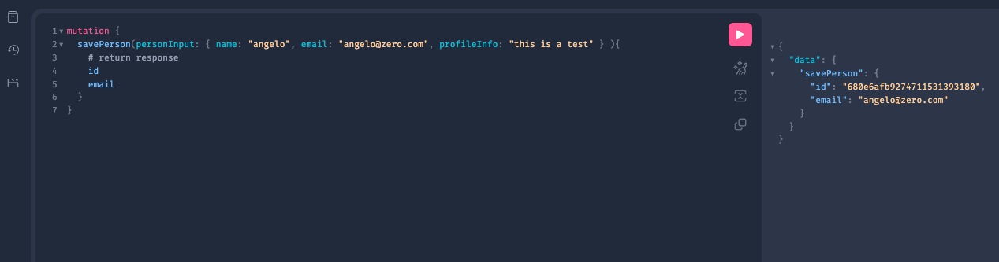
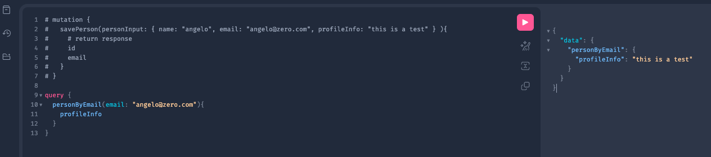

# Task Management Api

- 01 - Docker
- 02 - CRUD
- 03 - Pageable
- 04 - Sort by field ( Task ---> "description" )
- 05 - Intercept Handler Errors
- 06 - Integration tests ( all routes )
- 07 - Unit tests
- 08 - Integration wit external Api (PokeAPI)
- 09 - Circuit Breaker (https://www.youtube.com/watch?v=3-ChrD3Zosg)
- 10 - gRPC - GRAPHQL (https://www.youtube.com/watch?v=SPu77SaK-Hk)
  - test in http://localhost:8080/graphiql?path=/graphql
  - Mutation
    ```graphql
    mutation {
      savePerson(personInput: { name: "angelo", email: "angelo@zero.com", profileInfo: "this is a test" } ){
        id
        email
      }
    }
    ```
    - response 
    ```json
    {
      "data": {
        "savePerson": {
          "id": "680e6afb9274711531393180",
          "email": "angelo@zero.com"
        }
      }
    }
    ```
    
  - Query
    ```graphql
    query {
      personByEmail(email: "angelo@zero.com"){
        profileInfo
      }
    }
    ```
    - response 
    ```json
    {
      "data": {
        "personByEmail": {
          "profileInfo": "this is a test"
        }
      }
    }
    ```
  - 


- Next steps
  - Sealed and non sealed class 
  - Cash to the service for PokeApi using Redis (Docker)
  - Integration tests
  - RabbitMQ 
  - JWT Authentication