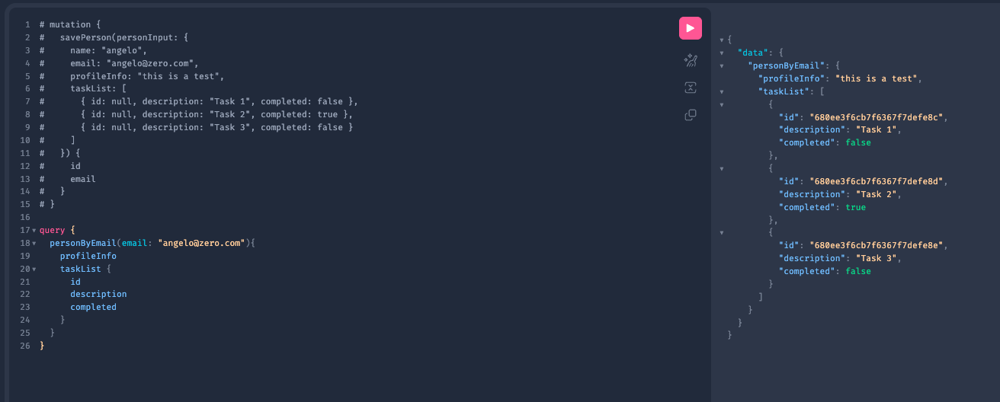

# Task Management Api

## Done
- 01 - Docker
- 02 - CRUD
- 03 - Pageable
- 04 - Sort by field ( Task ---> "description" )
- 05 - Intercept Handler Errors
- 06 - Integration tests ( all routes )
- 07 - Unit tests
- 08 - Integration wit external Api (PokeAPI)
- 09 - Circuit Breaker (https://www.youtube.com/watch?v=3-ChrD3Zosg)
- 10 - gRPC - GRAPHQL (https://www.youtube.com/watch?v=SPu77SaK-Hk)
  - test in http://localhost:8080/graphiql?path=/graphql
  - Mutation
    ```graphql
    mutation {
      savePerson(personInput: {
        name: "angelo",
        email: "angelo@zero.com",
        profileInfo: "this is a test",
        taskList: [
          { id: null, description: "Task 1", completed: false },
          { id: null, description: "Task 2", completed: true },
          { id: null, description: "Task 3", completed: false }
        ]}) {
        id
        email
      }
    }
    ```
    - response 
    ```json
    {
      "data": {
        "savePerson": {
          "id": "680e6afb9274711531393180",
          "email": "angelo@zero.com"
        }
      }
    }
    ```
  - Query
    ```graphql
    query {
      personByEmail(email: "angelo@zero.com"){
        profileInfo
        taskList {
          id
          description
          completed
        }
      }
    }
    ```
    - response 
    ```json
    {
      "data": {
        "personByEmail": {
          "profileInfo": "this is a test",
          "taskList": [
            {
              "id": "680ee3f6cb7f6367f7defe8c",
              "description": "Task 1",
              "completed": false
            },
            {
              "id": "680ee3f6cb7f6367f7defe8d",
              "description": "Task 2",
              "completed": true
            },
            {
              "id": "680ee3f6cb7f6367f7defe8e",
              "description": "Task 3",
              "completed": false
            }
          ]
        }
      }
    }
    ```
  - 
  - [Trying to use MockMvc to test a GraphQL API](https://github.com/spring-projects/spring-graphql/issues/779)
- 11 - Integrations tests (REST / GRAPHQL)
- 12 - Cash to the service for PokeApi using Redis (Docker)

## Doing
- Sealed and non sealed class 

## To do
- RabbitMQ 
- JWT Authentication with Keycloak
  - Keycloak
    - issue with object list in token
    - override auth token
    - custom config in a sub flow
- Dual datasource