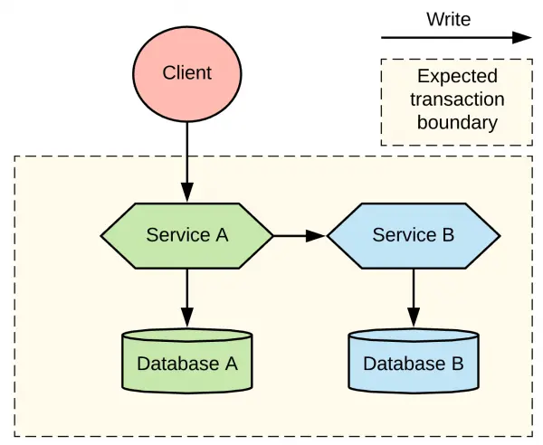

# Event/Notification Orchestration in Separate Read and Write Architecture
This document details how to orchestrate the reading and writing of events/notifications in a system that utilizes separate databases.

### 1. Overview
In a separate read and write architecture (CQRS - Command Query Responsibility Segregation), the workflow for events and notifications involves the following main steps:

- Event Generation: An event occurs in the system due to some user action or a change in the system state.
- Event Writing: The event is persisted in the write database.
- Event Processing (Optional): The event can be processed to perform additional actions, such as sending real-time notifications.
- Event Reading: Users query the read database to retrieve the events/notifications relevant to them.
- Event Status Update: When a user interacts with an event (for example, marks it as read), the event status is updated in the write database.


### 2. Sequence Diagram
[Distributed transaction patterns for microservices compared - by Bilgin Ibryam](https://developers.redhat.com/articles/2021/09/21/distributed-transaction-patterns-microservices-compared#choreography)




### 3. Step Details
- Event Writing:
    - When an event is generated, the application sends a command to the write service.
    - The write service validates the command and persists the event in the Event table in the write database.
    - The write database can publish a message to a message topic (e.g., RabbitMQ) to notify other services about the new event.

- Event Processing (Optional):
    - One or more services can subscribe to the message topic to receive notifications about new events.
    - These services can perform various actions, such as:
        - Sending push notifications to users (using WebSockets, Firebase Cloud Messaging, etc.).
        - Updating the unread notification count of users in a cache.
        - Generating data for the read database.
    - Event projection is used to transform events from the write database into optimized read models, which are then stored in the read database.


### 4. Event Reading
- When a user requests their notifications, the application queries the read database.
- The read database returns the relevant events/notifications to the user, already formatted for display.
- This query is optimized for high-performance reading.


### 5. Event Status Update
- When a user marks an event as read, the application sends a command to the write service.
- The write service updates the read field of the corresponding event in the Event table in the write database.
- This update can also generate a message event to invalidate any cached data in the read layer.

### 6. Involved Technologies
- Write database: PostgreSQL (port: 5678) 
- Read database: PostgreSQL (port: 5432)
- Message Broker: RabbitMQ

###  7. Events/Notifications:
- **Concept:** An entity to store events that occur in the system and need to be notified to users.
- **Writing:** When an event occurs (e.g., Task assigned, Status changed), the event is written to the write database.
- **Reading:** Users query the read database to view their notifications/events.

#### Example structure:

```java
@Entity
public class Event {
    @Id
    @GeneratedValue(strategy = GenerationType.IDENTITY)
    private Long id;
    private String eventType; // "TaskAssigned", "StatusChanged", "DeadlineApproaching"
    private Long entityId;    // ID of the related Task
    private Long userId;      // ID of the user to be notified
    private LocalDateTime timestamp;
    private boolean read;       // Indicates if the user has already seen the event
    private String message;     // Descriptive message of the event
}
```

- Workflow:
    - When an event occurs in the system, a new record is created in the Event table in the write database.
    - Once the event is written, a mechanism (for example, a service or an event listener) can be used to:
        - Send a real-time notification to the user (for example, using web sockets).
        - Update the user's unread notification count.
    - When a user logs into the system or accesses the notifications page, the system queries the read database to obtain the relevant events for that user.
    - The retrieved events are displayed to the user in the user interface.
    - When the user marks an event as read, the `read` field is updated in the write database.
- Benefits:
    - Decoupling: The system that generates the events does not need to worry about how users will be notified.
    - Scalability: The read database can be scaled separately to handle a large number of users querying their notifications.
    - Flexibility: New types of events can be added to the system without altering the database schema.